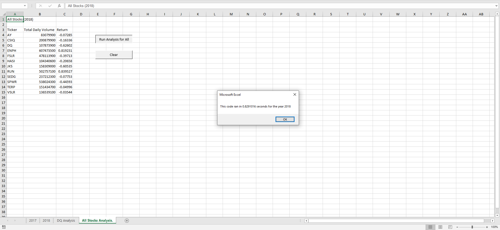
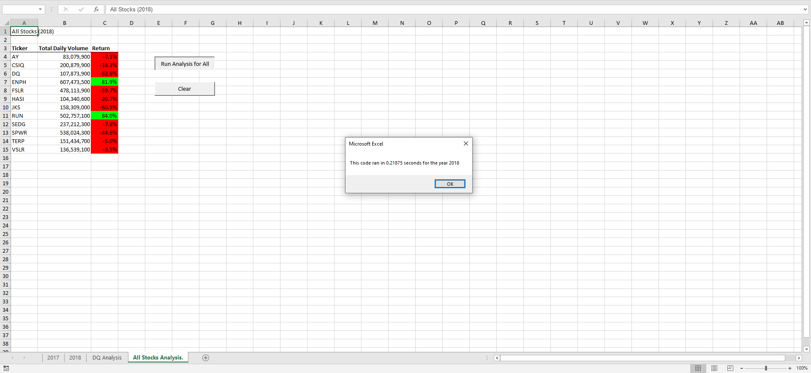

# stocks-analysis

## Overview
The purpose of this analysis is to be able to calculate how well certain stocks did in a given year. The stocks that were analyzed are AY, CSIQ, DQ, ENPH, FSLR, HASI, JKS, RUN, SEDG, SPWR, TERP, and VSLR. Originally, there was a separate loop through the entries for each stock. The code was refactored such that there is only one loop through the entries and the data for the appropriate stock is operated upon for each entry.

## Results
In 2017, all stocks had a positive return except TERP. In 2018, only ENPH and RUN had a positive return. All other stocks had a negative return.

### Declaring Stocks
Both before and after refactoring, the stocks are declared as follows:
```
    tickers(0) = "AY"
    tickers(1) = "CSIQ"
    tickers(2) = "DQ"
    tickers(3) = "ENPH"
    tickers(4) = "FSLR"
    tickers(5) = "HASI"
    tickers(6) = "JKS"
    tickers(7) = "RUN"
    tickers(8) = "SEDG"
    tickers(9) = "SPWR"
    tickers(10) = "TERP"
    tickers(11) = "VSLR"
```
### Loops

Before refactoring, the loops look like this:
```
    '4) Loop through tickers
    For i = 0 To 11
       ...
       '5) loop through rows in the data
       ...
       For j = 2 To RowCount
           ...
       Next j
       ...
    Next i
```

After refactoring, the loop looks like this:
```
    ''2b) Loop over all the rows in the spreadsheet.
    For i = 2 To RowCount
    
        '3a) Increase volume for current ticker
        tickerVolumes(tickerIndex) = tickerVolumes(tickerIndex) + Cells(i, 8).Value
        
        '3b) Check if the current row is the first row with the selected tickerIndex.
        ...
        
        '3c) check if the current row is the last row with the selected ticker
        ...
    
    Next i
```

After refactoring, there is only one loop instead of a loop inside of another loop. This results in the code running faster.

### Results with Time

Results for 2017 before refactoring:


Results for 2018 before refactoring:


Results for 2017 after refactoring:


Results for 2018 after refactoring:


## Summary
The main advantage of refactoring the code is that it runs faster. Other advantages are that the code can be simpler and can be easier to read. A disadvantage is that refactoring the code requires further analysis of the code.
Before refactoring the code, the results for 2017 were calculated in 0.8115234 seconds, and the results for 2018 were calculated in 0.8291016 seconds.
After refactoring the code, the results for 2017 were calculated in 0.140625 seconds, and the results for 2018 were calculated in 0.21875 seconds.
The code ran faster after it was refactored.
